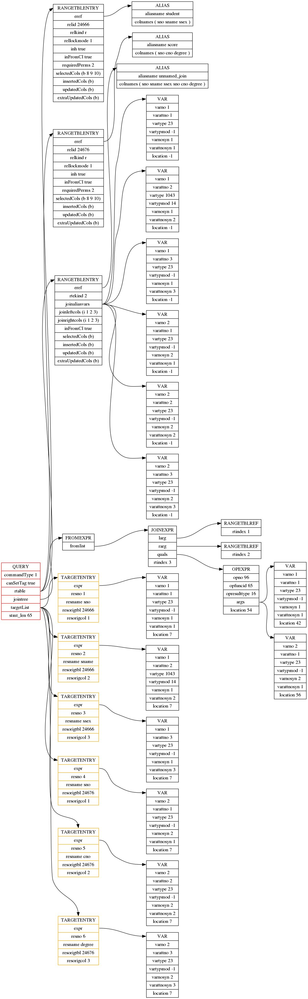
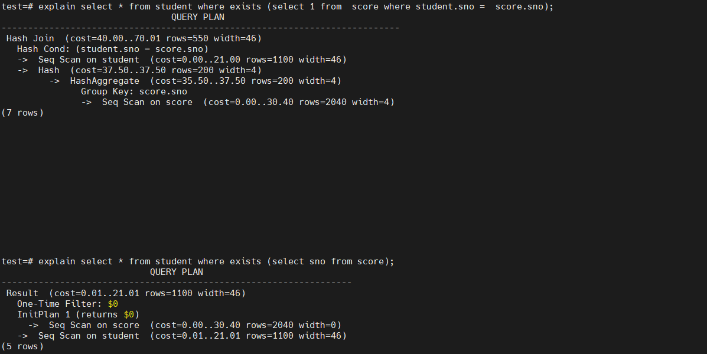
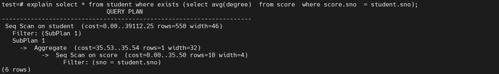
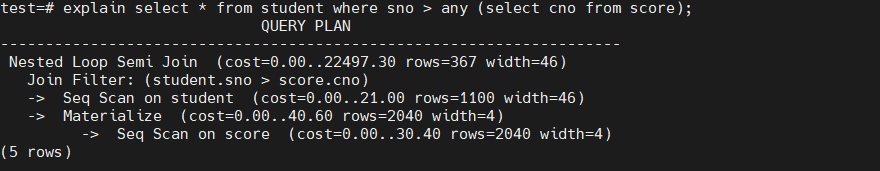
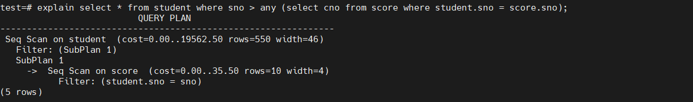
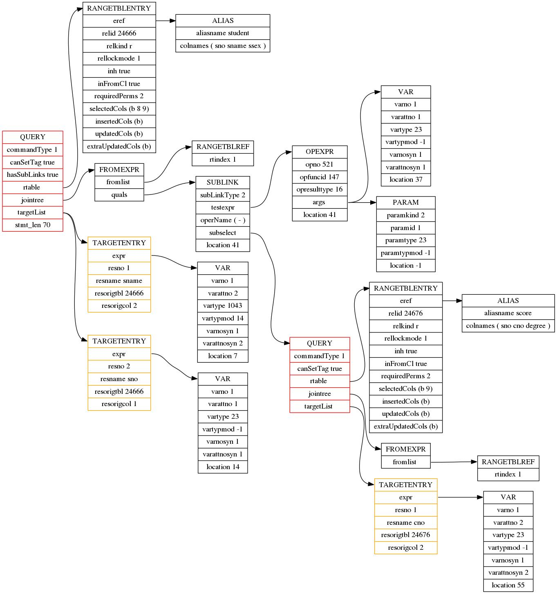

# 查询树和子连接(sublink)提升
1个SQL查询语句在经历 词法分析、语法分析、语义分析之后形成一棵查询树，这棵查询树对应一个**关系代数表达式**。查询树是查询优化器的输入。

## 1. 查询树中的节点类型
### 1.1 Node
NodeTag用来表示基于这种枚举扩展出来的结构体的类型。
```
/*
 * The first field of every node is NodeTag. Each node created (with makeNode)
 * will have one of the following tags as the value of its first field.
 *
 * Note that inserting or deleting node types changes the numbers of other
 * node types later in the list.  This is no problem during development, since
 * the node numbers are never stored on disk.  But don't do it in a released
 * branch, because that would represent an ABI break for extensions.
 */
typedef enum NodeTag
{
	T_Invalid = 0,

#include "nodes/nodetags.h"
} NodeTag;


/*
	 * The first field of a node of any type is guaranteed to be the NodeTag.
	 * Hence the type of any node can be gotten by casting it to Node. Declaring
	 * a variable to be of Node * (instead of void *) can also facilitate
	 * debugging.
 */
typedef struct Node
{
	NodeTag		type;
} Node;

e.g.
typedef struct List
{
	NodeTag		type;			/* T_List, T_IntList, T_OidList, or T_XidList */
	int			length;			/* number of elements currently present */
	int			max_length;		/* allocated length of elements[] */
	ListCell   *elements;		/* re-allocatable array of cells */
	/* We may allocate some cells along with the List header: */
	ListCell	initial_elements[FLEXIBLE_ARRAY_MEMBER];
	/* If elements == initial_elements, it's not a separate allocation */
} List;


typedef struct Query
{
	NodeTag		type;  /* T_Query */

	CmdType		commandType;	/* select|insert|update|delete|merge|utility */

	...
} Query;

都能通过Node结构体的指针Node*来表示List*，Query*；
通过查看Node类型的中的NodeTag就能区分该Node指针所代表结构体的实际类型

```
### 1.2 Var
var用于表示一列，是在语义分析阶段从ColumnRef转换而来。在SQL语句中投影的列属性，约束条件中的列属性都是通过Var来表示的，语法分析阶段通过ColumnRef结构体表示列属性，语义分析阶段语法树中的ColumnRef替换成Var用来表示一个列属性
```
typedef struct Var
{
	Expr		xpr;

	/*
	 * index of this var's relation in the range table, or
	 * INNER_VAR/OUTER_VAR/etc
	 */
	 /* 列属性所在的表的编号，编号从1开始，编号用rtindex表示，查询中出现的表在rtable中 */
	 /* 逻辑优化，物理优化的过程中可能varno都是rtindex, 在生成执行计划的阶段，它可能不再代表rtable中的的编号 */
	int			varno;

	/*
	 * attribute number of this var, or zero for all attrs ("whole-row Var")
	 */
	 /* 表示该列是表中的第几列 */
	AttrNumber	varattno;

	/* pg_type OID for the type of this var */
	/* 该列的类型 */
	Oid			vartype pg_node_attr(query_jumble_ignore);

	/* pg_attribute typmod value */
	/* attribute type modifier */
	int32		vartypmod pg_node_attr(query_jumble_ignore);
	
	/* OID of collation, or InvalidOid if none */
	Oid			varcollid pg_node_attr(query_jumble_ignore);

	/*
	 * RT indexes of outer joins that can replace the Var's value with null.
	 * We can omit varnullingrels in the query jumble, because it's fully
	 * determined by varno/varlevelsup plus the Var's query location.
	 */
	Bitmapset  *varnullingrels pg_node_attr(query_jumble_ignore);

	/*
	 * for subquery variables referencing outer relations; 0 in a normal var,
	 * >0 means N levels up
	 */
	 /* 列属性对应的表所在的层次，该值是一个相对值 */
	Index		varlevelsup;

	/*
	 * varnosyn/varattnosyn are ignored for equality, because Vars with
	 * different syntactic identifiers are semantically the same as long as
	 * their varno/varattno match.
	 */
	/* syntactic relation index (0 if unknown) */
	Index		varnosyn pg_node_attr(equal_ignore, query_jumble_ignore);
	/* syntactic attribute number */
	AttrNumber	varattnosyn pg_node_attr(equal_ignore, query_jumble_ignore);

	/* token location, or -1 if unknown */
	int			location;
} Var;
```

e.g.
```
SELECT st.sname FROM STUDENT st WHERE st.sno = ANY(SELECT sno FROM SCORE WHERE st. sno = sno);
```

```
",,,,,"select * from score;",,,"psql","client backend",,0
2023-11-13 14:49:08.345 CST,"postgres","test",108308,"[local]",6551c6c3.1a714,5,"SELECT",2023-11-13 14:48:35 CST,4/478,0,LOG,00000,"parse tree:","   {QUERY
   :commandType 1
   :querySource 0
   :canSetTag true
   :utilityStmt <>
   :resultRelation 0
   :hasAggs false
   :hasWindowFuncs false
   :hasTargetSRFs false
   :hasSubLinks true
   :hasDistinctOn false
   :hasRecursive false
   :hasModifyingCTE false
   :hasForUpdate false
   :hasRowSecurity false
   :isReturn false
   :cteList <>
   :rtable (
      {RANGETBLENTRY
      :alias
         {ALIAS
         :aliasname st
         :colnames <>
         }
      :eref
         {ALIAS
         :aliasname st
         :colnames (""sno"" ""sname"" ""ssex"")
         }
      :rtekind 0
      :relid 24666
      :relkind r
      :rellockmode 1
      :tablesample <>
      :lateral false
      :inh true
      :inFromCl true
      :requiredPerms 2
      :checkAsUser 0
      :selectedCols (b 8 9)
      :insertedCols (b)
      :updatedCols (b)
      :extraUpdatedCols (b)
      :securityQuals <>
      }
   )
   :jointree
      {FROMEXPR
      :fromlist (
         {RANGETBLREF
         :rtindex 1
         }
      )
      :quals
         {SUBLINK
         :subLinkType 2
         :subLinkId 0
         :testexpr
            {OPEXPR
            :opno 96
            :opfuncid 65
            :opresulttype 16
            :opretset false
            :opcollid 0
            :inputcollid 0
            :args (
               {VAR
               :varno 1
               :varattno 1
               :vartype 23
               :vartypmod -1
               :varcollid 0
               :varlevelsup 0
               :varnosyn 1
               :varattnosyn 1
               :location 38
               }
               {PARAM
               :paramkind 2
               :paramid 1
               :paramtype 23
               :paramtypmod -1
               :paramcollid 0
               :location -1
               }
            )
            :location 45
            }
         :operName (""="")
         :subselect
            {QUERY
            :commandType 1
            :querySource 0
            :canSetTag true
            :utilityStmt <>
            :resultRelation 0
            :hasAggs false
            :hasWindowFuncs false
            :hasTargetSRFs false
            :hasSubLinks false
            :hasDistinctOn false
            :hasRecursive false
            :hasModifyingCTE false
            :hasForUpdate false
            :hasRowSecurity false
            :isReturn false
            :cteList <>
            :rtable (
               {RANGETBLENTRY
               :alias <>
               :eref
                  {ALIAS
                  :aliasname score
                  :colnames (""sno"" ""cno"" ""degree"")
                  }
               :rtekind 0
               :relid 24676
               :relkind r
               :rellockmode 1
               :tablesample <>
               :lateral false
               :inh true
               :inFromCl true
               :requiredPerms 2
               :checkAsUser 0
               :selectedCols (b 8)
               :insertedCols (b)
               :updatedCols (b)
               :extraUpdatedCols (b)
               :securityQuals <>
               }
            )
            :jointree
               {FROMEXPR
               :fromlist (
                  {RANGETBLREF
                  :rtindex 1
                  }
               )
               :quals
                  {OPEXPR
                  :opno 96
                  :opfuncid 65
                  :opresulttype 16
                  :opretset false
                  :opcollid 0
                  :inputcollid 0
                  :args (
                     {VAR
                     :varno 1
                     :varattno 1
                     :vartype 23
                     :vartypmod -1
                     :varcollid 0
                     :varlevelsup 1
                     :varnosyn 1
                     :varattnosyn 1
                     :location 79
                     }
                     {VAR
                     :varno 1
                     :varattno 1
                     :vartype 23
                     :vartypmod -1
                     :varcollid 0
                     :varlevelsup 0
                     :varnosyn 1
                     :varattnosyn 1
                     :location 89
                     }
                  )
                  :location 87
                  }
               }
            :targetList (
               {TARGETENTRY
               :expr
                  {VAR
                  :varno 1
                  :varattno 1
                  :vartype 23
                  :vartypmod -1
                  :varcollid 0
                  :varlevelsup 0
                  :varnosyn 1
                  :varattnosyn 1
                  :location 58
                  }
               :resno 1
               :resname sno
               :ressortgroupref 0
               :resorigtbl 24676
               :resorigcol 1
               :resjunk false
               }
            )
            :override 0
            :onConflict <>
            :returningList <>
            :groupClause <>
            :groupDistinct false
            :groupingSets <>
            :havingQual <>
            :windowClause <>
            :distinctClause <>
            :sortClause <>
            :limitOffset <>
            :limitCount <>
            :limitOption 0
            :rowMarks <>
            :setOperations <>
            :constraintDeps <>
            :withCheckOptions <>
            :mergeActionList <>
            :mergeUseOuterJoin false
            :stmt_location 0
            :stmt_len 0
            }
         :location 45
         }
      }
   :targetList (
      {TARGETENTRY
      :expr
         {VAR
         :varno 1
         :varattno 2
         :vartype 1043
         :vartypmod 14
         :varcollid 100
         :varlevelsup 0
         :varnosyn 1
         :varattnosyn 2
         :location 7
         }
      :resno 1
      :resname sname
      :ressortgroupref 0
      :resorigtbl 24666
      :resorigcol 2
      :resjunk false
      }
   )
   :override 0
   :onConflict <>
   :returningList <>
   :groupClause <>
   :groupDistinct false
   :groupingSets <>
   :havingQual <>
   :windowClause <>
   :distinctClause <>
   :sortClause <>
   :limitOffset <>
   :limitCount <>
   :limitOption 0
   :rowMarks <>
   :setOperations <>
   :constraintDeps <>
   :withCheckOptions <>
   :mergeActionList <>
   :mergeUseOuterJoin false
   :stmt_location 0
   :stmt_len 93
   }
",,,,,"SELECT st.sname FROM STUDENT st WHERE st.sno = ANY(SELECT sno FROM SCORE WHERE st. sno = sno);",,,"psql","client backend",,0                     
```
### 1.3 RangeTblEntry
RangeTblEntry（RTE）描述了查询中出现的表，定义在parsenodes.h.堆表，子查询，连接表。
```
typedef enum RTEKind
{
	RTE_RELATION,				/* ordinary relation reference */
	RTE_SUBQUERY,				/* subquery in FROM */
	RTE_JOIN,					/* join */
	RTE_FUNCTION,				/* function in FROM */
	RTE_TABLEFUNC,				/* TableFunc(.., column list) */
	RTE_VALUES,					/* VALUES (<exprlist>), (<exprlist>), ... */
	RTE_CTE,	               /* common table expr (WITH list element) */
	RTE_NAMEDTUPLESTORE,		/* tuplestore, e.g. for AFTER triggers */
	RTE_RESULT					/* RTE represents an empty FROM clause; such
								 * RTEs are added by the planner, they're not
								 * present during parsing or rewriting */
} RTEKind;

typedef struct RangeTblEntry
{
	
	NodeTag		type;

	RTEKind		rtekind;		/* see above */
	Oid			relid;			/* OID of the relation */
	char		relkind;		/* relation kind (see pg_class.relkind) */
	int			rellockmode;	/* lock level that query requires on the rel */
	struct TableSampleClause *tablesample;	/* sampling info, or NULL */
	Index		perminfoindex;

	/*
	 * Fields valid for a subquery RTE (else NULL):
	 */
	Query	   *subquery;		/* the sub-query */
	......
}RangeTblEntry;
```

```
SELECT * FROM STUDENT LEFT JOIN SCORE ON TRUE, (SELECT * FROM TEACHER) AS t, COURSE, (VALUES (1, 1)) AS NUM(x , y), GENERATE SERIES(1,10) AS GS(z) ; 
```

### 1.4 RangeTblRef
```
/*
 * RangeTblRef - reference to an entry in the query's rangetable
 *
 * We could use direct pointers to the RT entries and skip having these
 * nodes, but multiple pointers to the same node in a querytree cause
 * lots of headaches, so it seems better to store an index into the RT.
 */
typedef struct RangeTblRef
{
	NodeTag		type;
	int			rtindex;
} RangeTblRef;
```

### 1.5 JoinExpr

```
typedef struct JoinExpr
{
	NodeTag		type;
	JoinType	jointype;		/* type of join */
	bool		isNatural;		/* Natural join? Will need to shape table */
	Node	   *larg;			/* left subtree */
	Node	   *rarg;			/* right subtree */
	List	   *usingClause;	/* USING clause, if any (list of String) */
	Node	   *quals;			/* qualifiers on join, if any */
	Alias	   *alias;			/* user-written alias clause, if any */
	int			rtindex;		/* RT index assigned for join, or 0 */
} JoinExpr;
```

```
SELECT * FROM student INNER JOIN score ON STUDENT.sno = SCORE.sno; 
```
[](https://github.com/nullemp/postgres_notes/blob/master/image/Snipaste_2023-11-03_18-47-59.png?raw=true)

```
SELECT sno FROM (SELECT sno FROM STUDENT WHERE sno > ANY (SELECT sno FROM SCORE)) sc LEFT JOIN COURSE ON TRUE ; 

```
[](https://github.com/nullemp/postgres_notes/blob/master/image/Snipaste_2023-11-03_18-47-59.png?raw=true)

 ### 1.6 FromExpr
 ```
 /*----------
 * FromExpr - represents a FROM ... WHERE ... construct
 *
 * This is both more flexible than a JoinExpr (it can have any number of
 * children, including zero) and less so --- we don't need to deal with
 * aliases and so on.  The output column set is implicitly just the union
 * of the outputs of the children.
 *----------
 */
typedef struct FromExpr
{
	NodeTag		type;
	List	   *fromlist;		/* List of join subtrees */
	Node	   *quals;			/* qualifiers on join, if any */
} FromExpr;
 ```
[](https://github.com/nullemp/postgres_notes/blob/master/image/Snipaste_2023-11-03_18-47-59.png?raw=true)

 ### 1.7 Query
 用Query表示查询树，查询树作为优化模块的输入参数，对其进行等价变换，重写为一棵新的查询树（逻辑优化），新的查询树作为物理优化的输入参数，进行物理优化。
 
## 2. 逻辑重写优化-提升子链接

## 2.1 子查询和子连接关系
子链接是子查询的一种特殊情况，在实际应用中可以通过子查询所处的位置来区分子连接和子查询，出现在FROM关键字后的子句是子查询语句，出现在WHEN/ON等约束条件中或投影中的子句是子连接,子连接通常伴随着 ANY/ALL/IN/EXISTS SOME 等谓词同时出现， PostgreSQL数据库依每种不同的谓词区分SUBLINK类型。

**相关子查询**： 指在子查询语句中引用了外层表的列属性，这就导致外层表每获得一个元组，子查询就需要重新执行一次。

**非相关子查询**： 指在子查询语句是独立的，和外层的表没有直接的关联，子查询可以单独执行一次，外层表可以重复利用子查询的执行结果。

PostgreSQL 数据库还基于子查询所在的**位置**和**作用**的不同，将子查询细分成了两类：
**SubLink:**   以表达式的方式存在，位置上来说一般出现在WHERE/ON约束条件中或者说投影中的子句。
```
SELECT (SELECT AVG(degree) FROM SCORE ), sname FROM STUDENT ; 
```

**SubQuery:**  范围表的方式存在，位置上来说一般在FROM后

```
select * from student, (select * from score) as sc;
```
 ```

 typedef enum SubLinkType
{
	EXISTS_SUBLINK,
	ALL_SUBLINK,
	ANY_SUBLINK,
	ROWCOMPARE_SUBLINK,
	EXPR_SUBLINK,
	MULTIEXPR_SUBLINK,
	ARRAY_SUBLINK,
	CTE_SUBLINK					/* for SubPlans only */
} SubLinkType;

 typedef struct SubLink
{
	Expr		xpr;
	SubLinkType subLinkType;	/* see above */
	int			subLinkId;		/* ID (1..n); 0 if not MULTIEXPR */
	Node	   *testexpr;		/* outer-query test for ALL/ANY/ROWCOMPARE */
	/* originally specified operator name */
	List	   *operName pg_node_attr(query_jumble_ignore);
	/* subselect as Query* or raw parsetree */
	Node	   *subselect;
	int			location;		/* token location, or -1 if unknown */
} SubLink;
 ```
## 2.2 什么情况下能提升子连接
能提升的是相关子链接，但不是所有的相关子连接都会进行提升上的重写。非相关子连接会形成子执行计划单独求解。
[](https://github.com/nullemp/postgres_notes/blob/master/image/Snipaste_2023-11-03_18-47-59.png?raw=true)

[](https://github.com/nullemp/postgres_notes/blob/master/image/Snipaste_2023-11-03_18-47-59.png?raw=true)

## 2.3 谓词为ANY的子链接提升过程
### 2.3.1 看起来是非相关类型的，但是还是进行了优化。
```
explain select sno from student where sno > any (select cno from score);
```

[](https://github.com/nullemp/postgres_notes/blob/master/image/Snipaste_2023-11-03_18-47-59.png?raw=true)

### 2.3.2 PG不对ANY类型的相关子连接进行提升

```
explain select * from student where sno > any (select cno from score where student.sno = score.sno)
```

[](https://github.com/nullemp/postgres_notes/blob/master/image/Snipaste_2023-11-03_18-47-59.png?raw=true)

问题：为什么？？？

**原则:** ANY类型的不相关子连接可以提升，并且可以通过物化的方式进行优化，ANY类型相关的子连接不能提升。

### 2.3.3 

```
select sname, sno from student where sno > any (select cno from score);
```

[](https://github.com/nullemp/postgres_notes/blob/master/image/Snipaste_2023-11-03_18-47-59.png?raw=true)

#### 2.3.3.1 ANY类型连接提升条件
1. ANY 类型的子连接如果是 “相关子连接”，即子连接中引用 了父查询的列属性 子连接不能提升。
2. ANY 类型 子连接 SubLink->testexpr 没有引用上一层的列， 不能提升， 这种情况中中的和上一层的表不能构连接关系。
3. ANY 类型的子连接左操作数如果不在available rels 中，子连接不能提升
4. ANY 型的子连接中 SubLink->testexpr 没有Var 即没有列属性，子连接不能提升
5. ANY 类型 子连接中 SubLink->testexpr中如果含有易失性函数（  VOLATILE STABLE IMMUTABLE 其中 VOLATILE 函数输入同样的参数会返回不同的结果，查询优化模块通常不对含有 VOLATILE 函数表达式进行优化），子连接不能提升。

* SubLink->subselect 中存储的是子连接的子句对应的查询树， 首先将这个查询树转变SubQuery类型的RangeTblEntry
```
	nsitem = addRangeTableEntryForSubquery(pstate,
										   subselect,
										   makeAlias("ANY_subquery", NIL),
										   false,
										   false);
	rte = nsitem->p_rte;
	parse->rtable = lappend(parse->rtable, rte);
```
*  SubLink->subselect 加入上层的rtable后，获得了新的rtindex ，根据这个rtindex生成RangeTblRef

```
	rtindex = list_length(parse->rtable);

	/*
	 * Form a RangeTblRef for the pulled-up sub-select.
	 */
	rtr = makeNode(RangeTblRef);
	rtr->rtindex = rtindex;
```

* 提取 SubLink->subselect查询树中的投影列，score.cno，给这个列属性生成新的Var变量
  
* 用上述步骤生成的Var替换 SubLink->testexpr中的Param 类型的变量，通过调convert_testexpr 函数来实现替换功能 convert_testexpr 函数会递归查找
SubLink_testexpr 中的 Param 变量 然后用对应的 Var 变量将其替换。
用Var替换 Param 之后 SubLink->testexpr 转换成
STUDENT.sno 对应的Var和 SCORE.cno 对应的 Var 进行 > 操作符比较的表达式，
STUDENT.sno > SCORE. cno

```
	/*
	 * Build the new join's qual expression, replacing Params with these Vars.
	 */
	quals = convert_testexpr(root, sublink->testexpr, subquery_vars);


   static Node *
convert_testexpr_mutator(Node *node,
						 convert_testexpr_context *context)
{
	if (node == NULL)
		return NULL;
	if (IsA(node, Param))
	{
		Param	   *param = (Param *) node;

		if (param->paramkind == PARAM_SUBLINK)
		{
			if (param->paramid <= 0 ||
				param->paramid > list_length(context->subst_nodes))
				elog(ERROR, "unexpected PARAM_SUBLINK ID: %d", param->paramid);

			/*
			 * We copy the list item to avoid having doubly-linked
			 * substructure in the modified parse tree.  This is probably
			 * unnecessary when it's a Param, but be safe.
			 */
			return (Node *) copyObject(list_nth(context->subst_nodes,
												param->paramid - 1));
		}
	}
```

* 这时即有了新的RangeTblRef，也有了新的quals ，就可以生成新的JoinExpr ，新的 RangeTblRef 作为连接的阳RHS端，约束条件就是SubLink->testexpr 转换后的表达式，这时候生成的 JoinExpr 是不完整的，它的 LHS端目前是 NULL, LHS 的值由 pull_up_sublinks_qual_recurse 函数去填充。

```
	/*
	 * And finally, build the JoinExpr node.
	 */
	result = makeNode(JoinExpr);
	result->jointype = JOIN_SEMI;
	result->isNatural = false;
	result->larg = NULL;		/* caller must fill this in */
	result->rarg = (Node *) rtr;
	result->usingClause = NIL;
	result->join_using_alias = NULL;
	result->quals = quals;
	result->alias = NULL;
	result->rtindex = 0;		/* we don't need an RTE for it */

```

```
SELECT sname FROM STUDENT SEMI JOIN (SELECT cno FROM SCORE) ANY subquery WHERE STUDENT. sno > ANY subquery.cno;
```


SELECT * FROM STUDENT LEFT JOIN SCORE ON TRUE LEFT JOIN COURSE ON SCORE.cno = COURSE.cno;