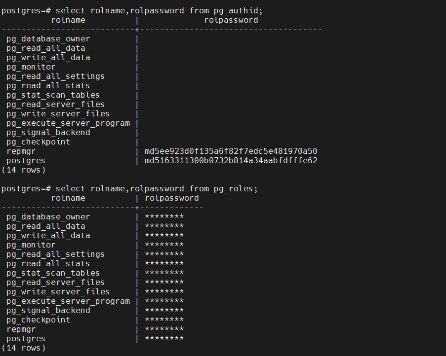

# postgres 修改验证方式
postgresql加密方式
password_encryption是动态参数，修改配置参数不需要重启服务，可动态加载

**方式1.md5**
1.存储方式：md5(‘用户名+密码’)
2.在版本14之前，默认加密方式是md5

**方式2.scram-sha-256**
1. 从10+（含10）版本开始支持SCRAM-SHA-256
2. 低版本的驱动不支持SCRAM-SHA-256，如JDBC会出现The authentication type 10 is not supported错误信息
是否支持scram的驱动参考表:https://wiki.postgresql.org/wiki/List_of_drivers
3. 14+（含14）版本后密码加密默认是scram-sha-256

## 1. 查看加密方式
```
select name,setting from pg_settings where name ='password_encryption';
或者
show password_encryption;
```


## 2. sha256需要加载pgcrypto插件
```
##安装插件
create extension pgcrypto;

##查看插件信息
\dx
或者
select * from pg_available_extensions;

##遇到错误
ERROR: could not open extension control file "/usr/local/pgsql/share/extension/pgcrypto.control": No such file or directory

##解决办法
1）原始的安装包的contrib路径下找到对应的插件信息/data/postgresql-11.4/contrib/pgcrypto
2）cd /data/postgresql-11.4/contrib/pgcrypto
3）make USE_PGXS=1
4）make USE_PGXS=1 install

ps:直接使用make install还是有可能会出现以下错误信息：
Makefile:48: ../../src/Makefile.global: No such file or directory
Makefile:49: /contrib/contrib-global.mk: No such file or directory
make: *** No rule to make target `/contrib/contrib-global.mk'.  Stop.

```

## 3. 升级加密方式
### 3.1 查看用户密码信息
```
##密码相关的表信息,可以看到具体的加密方式
select usename,passwd from pg_shadow;
select rolname,rolpassword from pg_authid;

##看到密码信息是******
select usename,passwd from pg_user;
select rolname,rolpassword from pg_roles;

```
[](https://markdown.com.cn)

### 3.2 升级步骤
1. 开发确定客户端工具驱动支持scram-sha-256的加密方式，不支持则需要进行客户端升级
2. 通过pg_shadow和pg_authid两张表进行查询，确认非scram加密用户
```
select usename,passwd from pg_shadow where passwd not like 'SCRAM-SHA-256%';

select rolname,rolpassword from pg_authid where rolpassword not like 'SCRAM-SHA-256%';
```
3. 修改对应的加密配置参数

```
alter system set password_encryption='scram-sha-256';
##热加载
select pg_reload_conf();
```
4. 重设非scram-sha-256用户

```
\password username

```
5. 查看用户密码是否全部修改成sha-256

```
select rolname,rolpassword from pg_authid where rolpassword not like 'SCRAM-SHA-256%';
```
6. 检查用户登录是否正常
